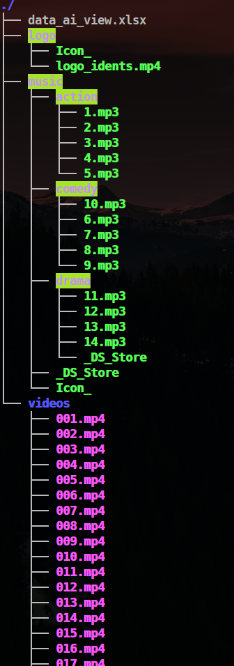

## Use deploy scripts automatic get the demo

### Now finished just one deploy script that based on Debian(Debian, Ubuntu, Elementary and so on) Linux system 

#### download the ai_view_demo_ubuntu_or_debian_platform.sh

[Download](https://minhaskamal.github.io/DownGit/#/home?url=https://github.com/YueNing/AI_View/blob/master/deploy_scripts/demos/ai_view_demo_ubuntu_or_debian_platform.sh)

And then run the script

Firstly: you need to create a directory(workspace), while that script will automatic download source code from github, for example

`mkdir AI_View`

Then move the file ai_view_demo_ubuntu_or_debian_platform.sh that you have downloaded into this directory.

change the permission of this script in order to let the file that can run in terminal

```
chmod +x ai_view_demo_ubuntu_or_debian_platform.sh
./ai_view "your source video google drive share link"
```

you can save the relative videos, music, logo into google drive, and get the share link. the structur of the sources.zip file is showed under.



In the time that you run this script, you need to input two times password, first is your sudo password, second is the username and password of this AI system. with this you can administrate the database by input this link : `http://127.0.0.0:8000/admin`

> ***Note:*** Now this script just can run in the local machine, than means your personal computer. But can config in cloud computer, you need to change the ip by hand, in order to can visit this system by use the ip of the cloud computer. otherwise you can not reach to this system