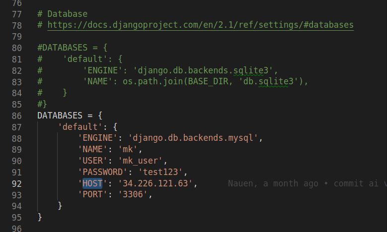
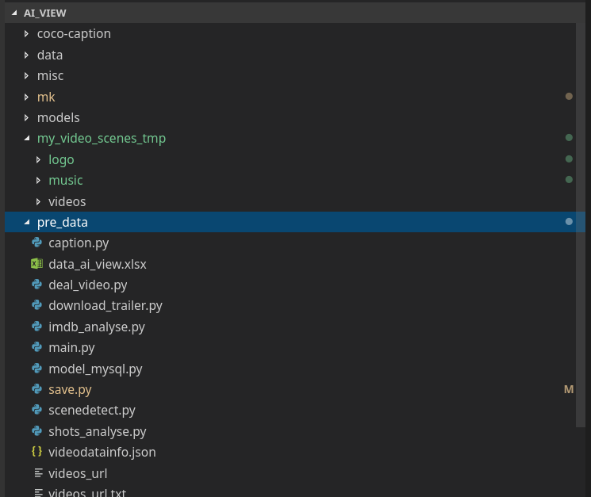
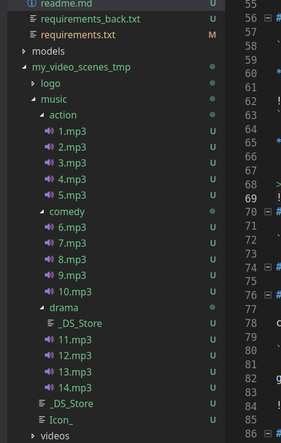
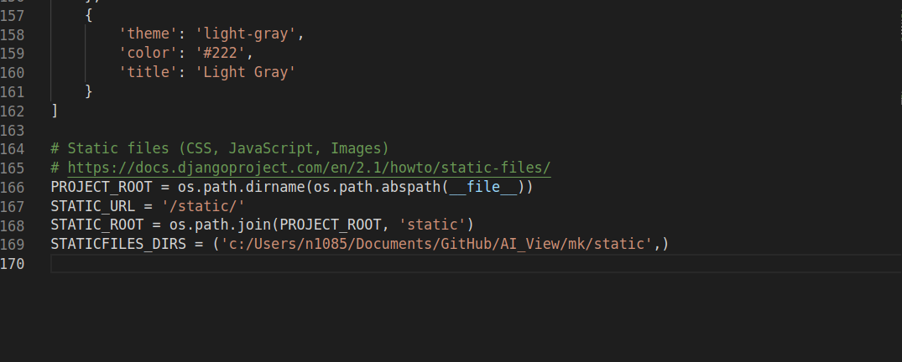

# AI VIEW Demo System(how to use)
## ***(automated deployment script)[https://github.com/YueNing/AI_View/tree/master/deploy_scripts]***
## Prepare System environment and setup code
### Install System relative Packages

- Ubuntu: `sudo apt install python3 ffmpeg mysql-server mysql-client`
- Mac Os: `brew install python3 ffmpeg mysql`
- Windows: ***use Anaconda***

### prepare a python3 virtual environment 

```
cd ~ && mkdir medienkunst
virtualenv --no-site-packages -p /usr/bin/python3.6 medienkunst && source medienkunst/bin/activate
```

### Download the source code from github

`cd ~ && git clone https://github.com/YueNing/AI_View.git`

### Install python packages

`cd ~/AI_View/mk && pip3 install -r requirements.txt`

### prepare mysql database

- Ubuntu: `sudo mysql -u root -p`
- Mac Os: [Setup Mysql in Mac OS](https://gist.github.com/nrollr/3f57fc15ded7dddddcc4e82fe137b58e)

```
GRANT ALL PRIVILEGES ON *.* TO 'mk_user'@'localhost' IDENTIFIED BY 'test123';
CREATE DATABASE mk;
FLUSH PRIVILEGES;
EXIT;
```

### initial the database

### change the setting file 

`cd ~/AI_View/mk/mk/`

change the HOST to 127.0.0.1 or localhost



```
cd ~/AI_View/mk 
python3 manage.py createsuperuser
python3 manage.py makemigrations
python3 manage.py migrate
```

## Prepare the shot videos and save relative information into database

### Save all short videos/logovideo/music and descriptions file .xlsx

`cd ~/AI_View/my_video_scenes_tmp/`

***Save all videos, logo video, music here show in picture***


`cd ~/AI_View/pre_data`

***save the data_ai_view.xlsx file descriptions of videos under pre_data***


> and the name of musics are needed to been changed, show in under picture


### Prepare data and Save relative information into Database mk

`cd ~/AI_View/pre_data/ && python3 ./save.py`

## Run the System

### Change the static files directorys

change the STATICFILES_DIRS to you directory

`cd ~/AI_View/mk/ && pwd`

get the results change the STATICFILES_DIRS



### Run

now run the system 

`cd ~/AI_View/mk && python3 manage.py runserver `


